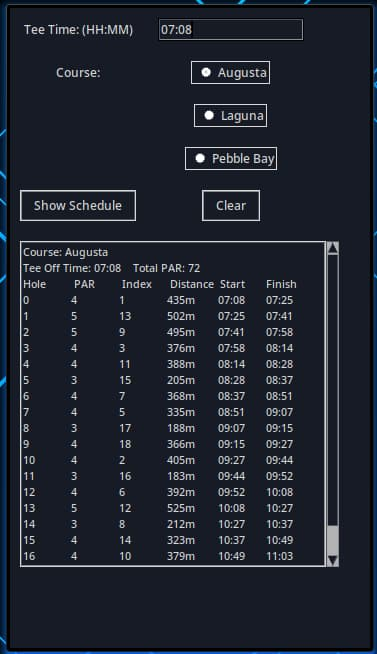

<div align = "center">

<h1><a href="https://2kabhishek.github.io/golf-manager">Golf Manager</a></h1>

<a href="https://github.com/2KAbhishek/golf-manager/blob/main/LICENSE">
 </a>

<a href="https://github.com/2KAbhishek/golf-manager/pulse">
 </a>

<a href="https://github.com/2KAbhishek/golf-manager/stargazers">
</a>

<a href="https://github.com/2KAbhishek/golf-manager/network/members">
 </a>

<a href="https://github.com/2KAbhishek/golf-manager/watchers">
 </a>

<a href="https://github.com/2KAbhishek/golf-manager/graphs/contributors">
 </a>

<a href="https://github.com/2KAbhishek?tab=followers">
 </a>

<h3>Manage your golf empire ⛳🏌</h3>

<figure>
  
  <br/>
  <figcaption>golf-manager screenshot</figcaption>
</figure>

</div>

## What is this

Golf manager is a CLI and GUI application that helps you manage your fictional golf empire.
It uses OOP principles to create the different models and uses `tkinter` for the GUI.

## Inspiration

Wanted to learn more about Golf and was in the mood for some `python`.

## Prerequisites

Before you begin, ensure you have met the following requirements:

- You have installed the latest version of `python` and `tkinter`.

## Getting golf-manager

To install golf-manager, follow these steps:

```bash
git clone https://github.com/2kabhishek/golf-manager
cd golf-manager
```

## Using golf-manager

To run the CLI version run [golf_manager.py](./src/golf_manager.py)
To run the GUI version run [golf_manager_gui.py](./src/golf_manager_gui.py)
The data is stored in the [data](./data/) directory.

## How it was built

golf-manager was built using `python` and `tkinter`.

## Challenges faced

Figuring out the structure and design of the application was a challenge.

## What I learned

- Explored OOP in depth using Python.
- Used `tkinter` to create the GUI.
- Created custom [switch](./src/switch.py) in python.

Hit the ⭐ button if you found this useful.

## More Info

<div align="center">

<a href="https://github.com/2KAbhishek/golf-manager">Source</a> | <a href="https://2kabhishek.github.io/golf-manager">Website</a>

[Golf on Wikipedia](https://en.wikipedia.org/wiki/Golf)

</div>
